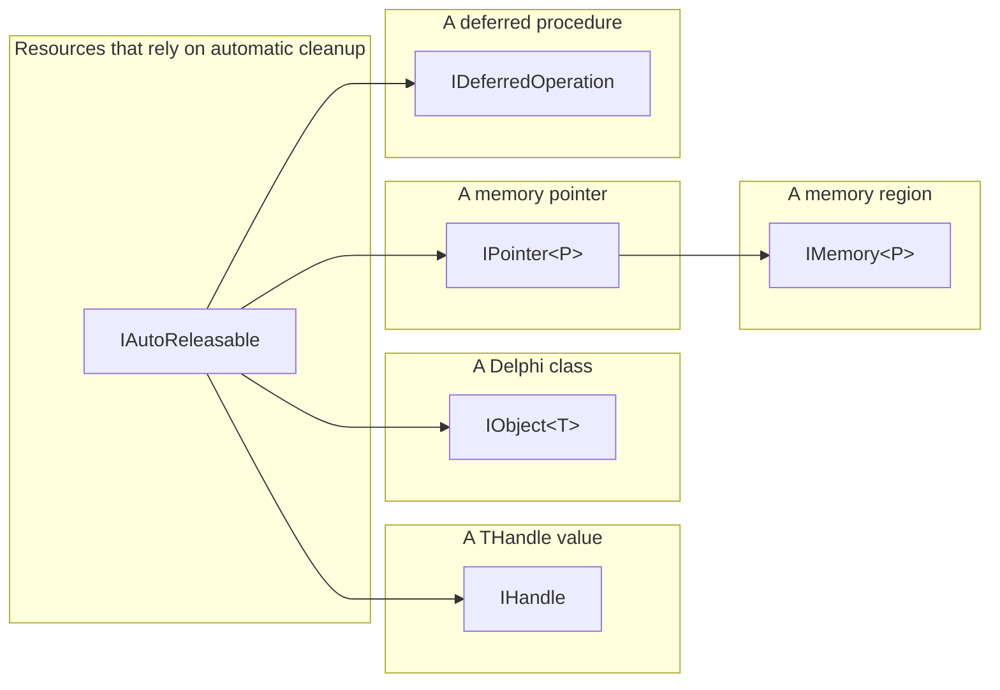

# NtUtils Library

**NtUtils** is a framework for Windows system programming in Delphi that provides a set of functions with better error handling and language integration than regular Winapi/Ntapi [headers](./Headers/Readme.md), combined with frequently used code snippets and intelligent data types.

You can find some example code in a [**dedicated repository**](https://github.com/diversenok/NtUtilsLibrary-Examples).

## Dependencies

### Library Structure

The library has a layered structure with three layers in total:
 - [**Headers**](./Headers/Readme.md) layer defines data types and annotated function prototypes from Windows and Native API. It brings zero dependencies and contains almost no code. Note that the library is self-sufficient and **doesn't import Winapi units** that are included with Delphi. It's possible to mix the built-in `Winapi.*.pas` and library `Ntapi.*.pas` headers in your program; although, it might require explicitly specifying the namespace prefix in case of conflicting names.
 - [**NtUtils**]() layer provides most of the functionality of the library by offering hundreds of wrappers for various categories of OS APIs. It depends exclusively on the headers layer and **not even on System.SysUtils**, so it barely increases the size of compiled executables.
 - [**NtUiLib**](./NtUiLib) layer adds support for reflective data representation meant for the end-users. It depends on NtUtils, `System.SysUtils`, `System.Rtti`, and `System.Generics.Collections`. **Update:** the library is currently transitioning to our custom lightweight RTTI/reflection engine (without any of above-mentioned dependencies like `System.Rtti`), so information on this layer is becoming outdated.

Therefore, everything you need is already included with the latest [free version of Delphi](https://www.embarcadero.com/products/delphi/starter). As a bonus, compiling console applications without RTTI (aka reflection) yields extremely small executables. See [examples](https://github.com/diversenok/NtUtilsLibrary-Examples) for more details.

### Unit Auto-discovery

Since including every file from the library into your projects is usually redundant, you can configure Delphi for file auto-discovery. This way, you can specify a unit in the `uses` section, and Delphi will automatically include it and its dependencies into the project. To configure the folders where Delphi performs the search, go to Project -> Options -> Building -> Delphi Compiler and add the following lines into the Search Path:

```
.\NtUtilsLibrary
.\NtUtilsLibrary\Headers
.\NtUtilsLibrary\NtUiLib
```

If the folder names or locations are different for your project, you need to adjust these lines correspondingly.

## Error Handling

### TNtxStatus

The library indicates failures to the caller by returning unsuccessful **TNtxStatus** values. `TNtxStatus` (defined in [NtUtils.pas](./NtUtils.pas)) is a structure that stores an error code (compatible with `NTSTATUS`, `HRESULT`, and a Win32 Errors) plus metadata about the nature of the attempted operation, such as the location of the failure, a stacktrace, and other details like expected/requested access mask for open calls or the info class value for query/set calls. To check if `TNtxStatus` is successful, use its `IsSuccess` method. To access or set the underlying error code (depending on its type and the caller's preference) use properties such as `Status`, `HResult`, `HResultAllowFalse`, `Win32Error`, `Win32ErrorOrSuccess`, `IsHResult`, `IsWin32`, etc.

### Exceptions

If you prefer using exceptions, you can always call `RaiseOnError()` on a given `TNtxStatus`. Note that unless you really want to use exceptions without importing `System.SysUtils` (which is possible), it's better to include [NtUiLib.Exceptions](./NtUiLib.Exceptions.pas) that brings a dedicated `ENtError` exception class  (derived from the built-in `EOSError`).

### Error Representation

[NtUiLib.Errors](./NtUiLib.Errors.pas) attaches four methods for representing `TNtxStatus` values as strings. For instance, if the error with value `0xC0000061` comes from an attempt to change a session ID of a token, these methods will return the following information:

Method        | Returned string
------------- | ---------------
`Name`        | `STATUS_PRIVILEGE_NOT_HELD`
`Description` | `A required privilege is not held by the client`
`Summary`     | `Privilege Not Held`
`ToString`    | `NtSetInformationToken returned STATUS_PRIVILEGE_NOT_HELD`

If you want to go even further and show a pretty message box to the user, [NtUiLib.Errors.Dialog](./NtUiLib/NtUiLib.Errors.Dialog.pas) offers `ShowNtxStatus()`. Additionally, including [NtUiLib.Exceptions.Dialog](./NtUiLib/NtUiLib.Exceptions.Dialog.pas) will bring necessary reflection support and enrich the dialog even further. Here is an example of how it might look:


### Stack Traces & Debug Symbols

`TNtxStatus` supports capturing stack traces (disabled by default). To enable it, set `NtUtils.CaptureStackTraces` to True. Keep in mind that displaying stack traces in a meaningful way requires configuring generation of debug symbols for your executable. Unfortunately, Delphi can only output simple text-based `.map` files (configured via Project -> Options -> Building -> Delphi Compiler -> Linking -> Map File) while this feature (and 3-rd party debuggers) require either `.dbg` (an older format) or `.pdb` (the newer format). After enabling map file generation in the project settings, you can add the following post-build events:

Option 1: use [**map2dbg** ](https://stackoverflow.com/questions/9422703) and [**cv2pdb**](https://github.com/rainers/cv2pdb).
```
map2dbg.exe $(OUTPUTPATH)
cv2pdb64.exe -n -s. -p$(OUTPUTNAME).pdb $(OUTPUTPATH)
``` 

Option 2: use [**map2pdb**](https://github.com/andersmelander/map2pdb).
```
cd $(OUTPUTDIR)
map2pdb.exe -bind $(OUTPUTNAME).map
```

Both methods produce `.pdb` symbols and attach a debug directory to the executable to make them discoverable to debuggers.

## Automatic Lifetime Management

Delphi does not include a garbage collector, so only a few types are managed out-of-the-box: records, strings, dynamic arrays, and interfaces. Classes and record pointers, on the other hand, require explicit cleanup which (in its safe form) means using *try-finally* blocks and, therefore, complicates the program significantly. To address this issue, the library includes facilities for automatic lifetime management of memory and other resources, implemented in [DelphiUtils.AutoObjects](./DelphiUtils.AutoObjects.pas) as dedicated wrappers:



### Classes and Records

The recipe for using automatic lifetime management is the following:

1. Define every variable that needs to maintain (a potentially shared) ownership over a resource using one of the interfaces:
   - For classes, use **IObject\<TMyObject\>**.
   - For dynamic memory accessible via a pointer, use **IMemory**, also known as **IMemory\<Pointer\>**.
   - For (managed) boxed records, use **IMemory\<PMyRecord\>**.
   
2. Use the **Auto** helper for allocating/copying/capturing objects:
   - **Auto.CaptureObject\<TMyObject\>(...)** to capture ownership of a class object derived from TObject.
   - **Auto.AllocateDynamic(...)** and **Auto.CopyDynamic(...)** to capture ownership over a new dynamic memory allocation.
   - **Auto.Allocate\<TMyRecord\>(...)** and **Auto.Copy\<TMyRecord\>(...)** to capture ownership over a new managed boxed record stored on the heap.

3. Access the underlying resource by using the corresponding method/property on the wrapper:
   - `Self` for classes.
   - `Data` and `Size` for pointers to records.

4. Do not manually call `Destroy`, `Free`, `FreeMem`, `Finalize`, or similar functions. It will happen automatically.

By wrapping resources requiring explicit cleanup into dedicated (genetic) interfaces, we instruct the compiler to generate thread- and exception-safe code for counting references and releasing the underlying resource whenever the wrapper goes out of scope.

For example, here is a safe code for working with a `TStringList` using the classical approach:

```pascal
var
  x: TStringList;
begin
  x := TStringList.Create;
  try
    x.Add('Hi there');
    x.SaveToFile('test.txt');
  finally
    x.Free;
  end;
end;
```

As you can imagine, using more objects in this function can drastically increase its complexity due to nesting *try-finally* blocks or keeping track of which variables were initialized. Alternatively, here is the equivalent code that uses **IObject** and scales way better:

```pascal
uses
  DelphiUtils.AutoObjects;
var
  x: IObject<TStringList>;
begin
  x := Auto.CaptureObject(TStringList.Create);
  x.Self.Add('Hi there');
  x.Self.SaveToFile('test.txt');
end; 
```

The compiler emits the necessary clean-up code into the function epilogue and makes sure it executes even if exceptions occur. Additionally, this approach allows maintaining shared ownership over the underlying object, which lets you save a reference that can outlive the current function (by capturing it in an anonymous function and returning it, for example). If you don't need this functionality and want to maintain single ownership that frees the object when the function exits, you can simplify the syntax even further:

```pascal
uses
  NtUtils;
var
  x: TStringList;
begin
  x := Auto.CaptureObject(TStringList.Create).Self;
  x.Add('Hi there');
  x.SaveToFile('test.txt');
end; 
```

This code is still equivalent to the initial one. Internally, it creates a hidden local variable that stores the wrapper interface and later releases the object, even in face of exceptions.

When working with dynamic memory allocations, it can also be convenient to use left-side casting as following:

```pascal
var
  x: IMemory<PByteArray>;
begin
  IMemory(x) := Auto.AllocateDynamic(100);
  x.Data[15] := 20;
end;
```

You can create boxed (allocated on the heap) managed records that allow sharing value types as if they are reference types. Note that they can also include managed fields like Delphi strings and dynamic arrays - the compiler emits code for releasing them automatically:

```pascal
type
  TMyRecord = record
    MyInteger: Integer;
    MyArray: TArray<Integer>;
  end;                   
  PMyRecord = ^TMyRecord;

var
  x: IMemory<PMyRecord>;
begin
  IMemory(x) := Auto.Allocate<TMyRecord>;
  x.Data.MyInteger := 42;
  x.Data.MyArray := [1, 2, 3];
end;
```

While most library code uses memory managed by `AllocMem`/`FreeMem`, some units define compatible implementations that rely on `RtlFreeHeap`, `LocalFree`, and other similar functions. To create a non-owning wrapper, you can use `Auto.RefObject<TMyObject>(...)`, `Auto.RefAddress(...)`, `Auto.RefAddressRange(...)`, or `Auto.RefBuffer<TMyRecord>(...)`;

There are some aliases available for commonly used variable-size pointer types, here are a few examples:

 - IPointer = IPointer\<Pointer\>;
 - IMemory = IMemory\<Pointer\>;
 - ISid = IPointer\<PSid\>;
 - IAcl = IPointer\<PAcl\>;
 - ISecurityDescriptor = IPointer\<PSecurityDescriptor\>;
 - etc.

### Handles

Resources identified by a `THandle` value use the **IHandle** type (see [DelphiUtils.AutoObjects](./DelphiUtils.AutoObjects.pas)), so they do not require explicit closing. Since handles come in many different flavors, to take ownership of a handle, you need a class that implement cleanup for the specific type. For example, [NtUtils.Objects](./NtUtils.Objects.pas) defines such class for kernel objects that require calling `NtClose`. It also attaches a helper method to `Auto`, allowing capturing kernel handles by value via `Auto.CaptureHandle(...)`. [NtUtils.Svc](./NtUtils.Svc.pas) includes a class for making IHandle wrappers that call `CloseServiceHandle`; [NtUtils.Lsa](./NtUtils.Lsa.pas)'s wrapper calls `LsaClose`, etc. All of these classes implement IHandle, but you can also find some aliases for it (IScmHandle, ISamHandle, ILsaHandle, etc.), which are available for better code readability. To create a non-owning IHandle, use `Auto.RefHandle(...)`.

### (Weak) Interfaces

Since Delphi uses reference counting, it is still possible to leak memory if two objects have a circular dependency. You can prevent it from happening by using *weak references*. Such reference does not count for prolonging lifetime, and the variable that stores them becomes automatically becomes **nil** when the target object gets destroyed. Delphi already allows annotating variables and fields with the `[Weak]` attribute, however, the **Weak\<I\>** wrapper offers some advantages such as guaranteeing thread-safe upgrades for all objects derived from the new `TAutoInterfacedObject` class. See [DelphiUtils.AutoObjects](./DelphiUtils.AutoObjects.pas) for more details about this type.

If you want to use weak references with classes derived from the built-in `TInterfacedObject`, you can wrap them into `IStrong<I>` first via `Auto.RefStrong(...)` to guarantee thread-safety.

### Deferred Functions

Another feature available via the `Auto` helper is **deferred function calls**. It allows executing an anonymous function upon an interface variable cleanup and is most helpful for queueing operations to function epilogues. Here is an example:

```pascal
procedure MyProcedure;
begin
  writeln('Entering...');

  Auto.Defer(
    procedure
    begin
      writeln('Exiting...');
    end;
  );

  writeln('About to fail...');
  raise Exception.Create('Error Message');
  writeln('Never reached...');
end;
```

This code will print the following messages (while also throwing an exception):

```
Entering...
About to fail...
Exiting...
```

Deferring a call is equivalent to wrapping the entire function body into *try-finally* and adding the callback code into the finally statement. However, defers are more flexible because they are possible to store as variables and cancel (via the `Cancel` method on the returned `IDeferredOperation`). Effectively, a deferred operation is an anonymous function that automatically executes upon its release.

> Note that when using multiple defers in a single scope, it is better to save each result of `Auto.Defer(...)` to a dedicated local variable since the compiler might attempt to reuse hidden variables (and, thus, execute defers too early). The same applies to other automatic wrappers as well.

### Automatic Events

The library provides facilities for automatic **multi-callback event** delivery. As opposed to the built-in `System.Classes.TNotifyEvent` that only allows a single subscriber that must be an object method and cannot have extra parameters, [DelphiUtils.AutoEvents](./DelphiUtils.AutoEvents.pas) defines `TAutoEvent` and `TAutoEvent<T>` which can accept any number of anonymous function subscribers (so both functions and methods work) and can capture local variables. The library also reworks event lifetime model. Whenever somebody subscribes to an event, they receive an `IAutoReleasable`-typed registration object. The subscription remains active for as long as this object exists; releasing it unsubscribes the caller from the callback (and cleans up captured resources).

Keep in mind that, by default, if any of callbacks throw exceptions upon invocation, they might prevent other subscribers from executing. To handle exceptions during event delivery, you can provide `AutoExceptionHanlder` in [DelphiUtils.AutoObjects](./DelphiUtils.AutoObjects.pas).

## Naming Convention

Names of records, classes, and enumerations start with `T` and use CamelCase (example: `TTokenStatistics`). Pointers to records or other value-types start with `P` (example: `PTokenStatistics`). Names of interfaces start with `I` (example: `ISid`). Constants use ALL_CAPITALS. All definitions from the headers layer that have known official names (such as the types defined in Windows SDK) are marked with an `SDKName` attribute specifying this name.

Most functions use the following name convention: a prefix of the subsystem with _x_ at the end (Ntx, Ldrx, Lsax, Samx, Scmx, Wsx, Usrx, ...) + Action + Target/Object type/etc. Function names also use CamelCase.

## OS Versions

The library targets Windows 7 or higher, both 32- and 64-bit editions. Though, some of the functionality might be available only on the latest 64-bit versions of Windows 11. Some examples are AppContainers and ntdll syscall unhooking. If a library function depends on an API that might not present on Windows 7, it uses delayed import and checks availability at runtime. Search for the use of `LdrxCheckDelayedImport` for more details.

## Reflection (aka RTTI)

Delphi comes with a rich reflection system that the library utilizes within the [**NtUiLib**](./NtUiLib) layer. Most of the types defined in the [**Headers**](./Headers/Readme.md) layer are decorated with custom attributes (see [DelphiApi.Reflection](./Headers/DelphiApi.Reflection.pas))  to achieve it. These decorations emit useful metadata that helps the library to precisely represent complex data types (like PEB, TEB, USER_SHARED_DATA) in runtime and produce astonishing reports with a single line of code.

Here is an example representation of `TSecurityLogonSessionData` from [Ntapi.NtSecApi](./Headers/Ntapi.NtSecApi.pas) using [DelphiUiLib.LiteReflection.Types](./DelphiUiLib.LiteReflection.Types.pas):


## Unit overview

Here the overview of the purpose of different modules. 

### Base library modules

Support unit                                                                                     | Description
------------------------------------------------------------------------------------------------ | -----------
[DelphiUtils.AutoObjects](./DelphiUtils.AutoObjects.pas)                                         | Automatic resource lifetime management
[DelphiUtils.AutoEvents](./DelphiUtils.AutoEvents.pas)                                           | Multi-subscriber anonymous events
[DelphiUtils.Arrays](./DelphiUtils.Arrays.pas)                                                   | TArray helpers
[DelphiUtils.Lists](./DelphiUtils.Lists.pas)                                                     | A genetic double-linked list primitive
[DelphiUtils.ExternalImport](./DelphiUtils.ExternalImport.pas)                                   | Delphi external keyword IAT helpers
[DelphiUtils.RangeChecks](./DelphiUtils.RangeChecks.pas)                                         | Range checking helpers
[NtUtils](./NtUtils.pas)                                                                         | Common library types
[NtUtils.Files.Async](./NtUtils.Files.Async.pas)                                                 | Anonymous APC support for async I/O
[NtUtils.SysUtils](./NtUtils.SysUtils.pas)                                                       | String manipulation
[NtUtils.Errors](./NtUtils.Errors.pas)                                                           | Error code conversion
[NtUiLib.Errors](./NtUiLib.Errors.pas)                                                           | Error code name lookup
[NtUiLib.Exceptions](./NtUiLib.Exceptions.pas)                                                   | SysUtils exception integration
[DelphiUiLib.Strings](./DelphiUiLib.Strings.pas)                                                 | String prettification
[DelphiUiLib.Reflection.Records](./NtUiLib/DelphiUiLib.Reflection.Records.pas)                   | RTTI representation of record types
[NtUiLib.Console](./NtUiLib.Console.pas)                                                         | Console I/O helpers
[NtUiLib.TaskDialog](./NtUiLib/NtUiLib.TaskDialog.pas)                                           | TaskDialog-based GUI
[NtUiLib.Errors.Dialog](./NtUiLib/NtUiLib.Errors.Dialog.pas)                                     | GUI error dialog
[NtUiLib.Exceptions.Dialog](./NtUiLib/NtUiLib.Exceptions.Dialog.pas)                             | GUI exception dialog

### System API wrappers

System unit                                                                                      | Description
------------------------------------------------------------------------------------------------ | -----------
[NtUtils.ActCtx](./NtUtils.ActCtx.pas)                                                           | Activation contexts
[NtUtils.AntiHooking](./NtUtils.AntiHooking.pas)                                                 | Unhooking and direct syscall
[NtUtils.Com](./NtUtils.Com.pas)                                                                 | COM, IDispatch, WinRT
[NtUtils.Csr](./NtUtils.Csr.pas)                                                                 | CSRSS/SxS registration
[NtUtils.DbgHelp](./NtUtils.DbgHelp.pas)                                                         | DbgHelp and debug symbols
[NtUtils.DbgHelp.Dia](./NtUtils.DbgHelp.Dia.pas)                                                 | PDB parsing via MSDIA
[NtUtils.Debug](./NtUtils.Debug.pas)                                                             | Debug objects
[NtUtils.Dism](./NtUtils.Dism.pas)                                                               | DISM API
[NtUtils.Environment](./NtUtils.Environment.pas)                                                 | Environment variables
[NtUtils.Environment.User](./NtUtils.Environment.User.pas)                                       | User environment variables
[NtUtils.Environment.Remote](./NtUtils.Environment.Remote.pas)                                   | Environment variables of other processes
[NtUtils.Files](./NtUtils.Files.pas)                                                             | Win32/NT filenames
[NtUtils.Files.Open](./NtUtils.Files.Open.pas)                                                   | File and pipe open/create
[NtUtils.Files.Operations](./NtUtils.Files.Operations.pas)                                       | File operations
[NtUtils.Files.Directories](./NtUtils.Files.Directories.pas)                                     | File directory enumeration
[NtUtils.Files.FltMgr](./NtUtils.Files.FltMgr.pas)                                               | Filter Manager API
[NtUtils.Files.Mup](./NtUtils.Files.Mup.pas)                                                     | Multiple UNC Provider
[NtUtils.Files.Volumes](./NtUtils.Files.Volumes.pas)                                             | Volume operations
[NtUtils.Files.Control](./NtUtils.Files.Control.pas)                                             | FSCTL operations
[NtUtils.ImageHlp](./NtUtils.ImageHlp.pas)                                                       | PE parsing
[NtUtils.ImageHlp.Syscalls](./NtUtils.ImageHlp.Syscalls.pas)                                     | Syscall number retrieval
[NtUtils.ImageHlp.DbgHelp](./NtUtils.ImageHlp.DbgHelp.pas)                                       | Public symbols without DbgHelp
[NtUtils.Jobs](./NtUtils.Jobs.pas)                                                               | Job objects and silos
[NtUtils.Jobs.Remote](./NtUtils.Jobs.Remote.pas)                                                 | Cross-process job object queries
[NtUtils.Ldr](./NtUtils.Ldr.pas)                                                                 | LDR routines and parsing
[NtUtils.Lsa](./NtUtils.Lsa.pas)                                                                 | LSA policy
[NtUtils.Lsa.Audit](./NtUtils.Lsa.Audit.pas)                                                     | Audit policy
[NtUtils.Lsa.Sid](./NtUtils.Lsa.Sid.pas)                                                         | SID lookup
[NtUtils.Lsa.Logon](./NtUtils.Lsa.Logon.pas)                                                     | Logon sessions
[NtUtils.Manifests](./NtUtils.Manifests.pas)                                                     | Fusion/SxS manifest builder
[NtUtils.Memory](./NtUtils.Memory.pas)                                                           | Memory operations
[NtUtils.MiniDumps](./NtUtils.MiniDumps.pas)                                                     | Minidump format parsing
[NtUtils.Objects](./NtUtils.Objects.pas)                                                         | Kernel objects and handles
[NtUtils.Objects.Snapshots](./NtUtils.Objects.Snapshots.pas)                                     | Handle snapshotting
[NtUtils.Objects.Namespace](./NtUtils.Objects.Namespace.pas)                                     | NT object namespace
[NtUtils.Objects.Remote](./NtUtils.Objects.Remote.pas)                                           | Cross-process handle operations
[NtUtils.Objects.Compare](./NtUtils.Objects.Compare.pas)                                         | Handle comparison
[NtUtils.Packages](./NtUtils.Packages.pas)                                                       | App packages & package families
[NtUtils.Packages.ExecAlias](./NtUtils.Packages.ExecAlias.pas)                                   | App execution aliases
[NtUtils.Packages.SRCache](./NtUtils.Packages.SRCache.pas)                                       | State repository cache
[NtUtils.Packages.WinRT](./NtUtils.Packages.WinRT.pas)                                           | WinRT-based package info
[NtUtils.Power](./NtUtils.Power.pas)                                                             | Power-related functions
[NtUtils.Processes](./NtUtils.Processes.pas)                                                     | Process objects
[NtUtils.Processes.Info](./NtUtils.Processes.Info.pas)                                           | Process query/set info
[NtUtils.Processes.Info.Remote](./NtUtils.Processes.Info.Remote.pas)                             | Process query/set via code injection
[NtUtils.Processes.Modules](./NtUtils.Processes.Modules.pas)                                     | Cross-process LDR enumeration
[NtUtils.Processes.Snapshots](./NtUtils.Processes.Snapshots.pas)                                 | Process enumeration
[NtUtils.Processes.Create](./NtUtils.Processes.Create.pas)                                       | Common process creation definitions
[NtUtils.Processes.Create.Win32](./NtUtils.Processes.Create.Win32.pas)                           | Win32 process creation methods
[NtUtils.Processes.Create.Shell](./NtUtils.Processes.Create.Shell.pas)                           | Shell process creation methods
[NtUtils.Processes.Create.Native](./NtUtils.Processes.Create.Native.pas)                         | NtCreateUserProcess and co.
[NtUtils.Processes.Create.Manual](./NtUtils.Processes.Create.Manual.pas)                         | NtCreateProcessEx
[NtUtils.Processes.Create.Com](./NtUtils.Processes.Create.Com.pas)                               | COM-based process creation
[NtUtils.Processes.Create.Csr](./NtUtils.Processes.Create.Csr.pas)                               | Process creation via SbApiPort
[NtUtils.Processes.Create.Package](./NtUtils.Processes.Create.Package.pas)                       | Appx activation
[NtUtils.Processes.Create.Remote](./NtUtils.Processes.Create.Remote.pas)                         | Process creation via code injection
[NtUtils.Processes.Create.Clone](./NtUtils.Processes.Create.Clone.pas)                           | Process cloning
[NtUtils.Profiles](./NtUtils.Profiles.pas)                                                       | User profiles
[NtUtils.Profiles.AppContainer](./NtUtils.Profiles.AppContainer.pas)                             | AppContainer profiles
[NtUtils.Registry](./NtUtils.Registry.pas)                                                       | Registry keys
[NtUtils.Registry.Offline](./NtUtils.Registry.Offline.pas)                                       | Offline hive manipulation
[NtUtils.Registry.VReg](./NtUtils.Registry.VReg.pas)                                             | Silo-based registry virtualization
[NtUtils.Sam](./NtUtils.Sam.pas)                                                                 | SAM database
[NtUtils.Sections](./NtUtils.Sections.pas)                                                       | Section/memory projection objects
[NtUtils.Security](./NtUtils.Security.pas)                                                       | Security descriptors
[NtUtils.Security.Acl](./NtUtils.Security.Acl.pas)                                               | ACLs and ACEs
[NtUtils.Security.Sid](./NtUtils.Security.Sid.pas)                                               | SIDs
[NtUtils.Security.AppContainer](./NtUtils.Security.AppContainer.pas)                             | AppContainer & capability SIDs
[NtUtils.Shellcode](./NtUtils.Shellcode.pas)                                                     | Code injection
[NtUtils.Shellcode.Dll](./NtUtils.Shellcode.Dll.pas)                                             | DLL injection
[NtUtils.Shellcode.Exe](./NtUtils.Shellcode.Exe.pas)                                             | EXE injection
[NtUtils.Svc](./NtUtils.Svc.pas)                                                                 | SCM services
[NtUtils.Svc.SingleTaskSvc](./NtUtils.Svc.SingleTaskSvc.pas)                                     | Service implementation
[NtUtils.Synchronization](./NtUtils.Synchronization.pas)                                         | Synchronization primitives
[NtUtils.System](./NtUtils.System.pas)                                                           | System information
[NtUtils.TaskScheduler](./NtUtils.TaskScheduler.pas)                                             | Task scheduler
[NtUtils.Threads](./NtUtils.Threads.pas)                                                         | Thread objects
[NtUtils.Tokens.Info](./NtUtils.Tokens.Info.pas)                                                 | Thread query/set info
[NtUtils.Threads.Worker](./NtUtils.Threads.Worker.pas)                                           | Thread workers (thread pools)
[NtUtils.Tokens](./NtUtils.Tokens.pas)                                                           | Token objects
[NtUtils.Tokens.Impersonate](./NtUtils.Tokens.Impersonate.pas)                                   | Token impersonation
[NtUtils.Tokens.Logon](./NtUtils.Tokens.Logon.pas)                                               | User & S4U logon
[NtUtils.Tokens.AppModel](./NtUtils.Tokens.AppModel.pas)                                         | Token AppModel policy
[NtUtils.Transactions](./NtUtils.Transactions.pas)                                               | Transaction (TmTx) objects
[NtUtils.Transactions.Remote](./NtUtils.Transactions.Remote.pas)                                 | Forcing processes into transactions
[NtUtils.UserManager](./NtUtils.UserManager.pas)                                                 | User Manager service (Umgr) API
[NtUtils.Wim](./NtUtils.Wim.pas)                                                                 | Windows Imaging (*.wim) API
[NtUtils.WinSafer](./NtUtils.WinSafer.pas)                                                       | Safer API
[NtUtils.WinStation](./NtUtils.WinStation.pas)                                                   | Terminal server API
[NtUtils.WinUser](./NtUtils.WinUser.pas)                                                         | User32/GUI API
[NtUtils.WinUser.WindowAffinity](./NtUtils.WinUser.WindowAffinity.pas)                           | Window affinity modification
[NtUtils.WinUser.WinstaLock](./NtUtils.WinUser.WinstaLock.pas)                                   | Locking & unlocking window stations
[NtUtils.XmlLite](./NtUtils.XmlLite.pas)                                                         | XML parsing & crafting via XmlLite
[NtUiLib.AutoCompletion](./NtUiLib/NtUiLib.AutoCompletion.pas)                                   | Auto-completion for edit controls
[NtUiLib.AutoCompletion.Namespace](./NtUiLib/NtUiLib.AutoCompletion.Namespace.pas)               | NT object namespace auto-completion
[NtUiLib.AutoCompletion.Sid](./NtUiLib/NtUiLib.AutoCompletion.Sid.pas)                           | SID auto-completion
[NtUiLib.AutoCompletion.Sid.Common](./NtUiLib/NtUiLib.AutoCompletion.Sid.Common.pas)             | Simple SID name providers/recognizers
[NtUiLib.AutoCompletion.Sid.AppContainer](./NtUiLib/NtUiLib.AutoCompletion.Sid.AppContainer.pas) | AppContainer & package SID providers/recognizers
[NtUiLib.AutoCompletion.Sid.Capabilities](./NtUiLib/NtUiLib.AutoCompletion.Sid.Capabilities.pas) | Capability SID providers/recognizers
[NtUiLib.WinCred](./NtUiLib/NtUiLib.WinCred.pas)                                                 | Credentials dialog
