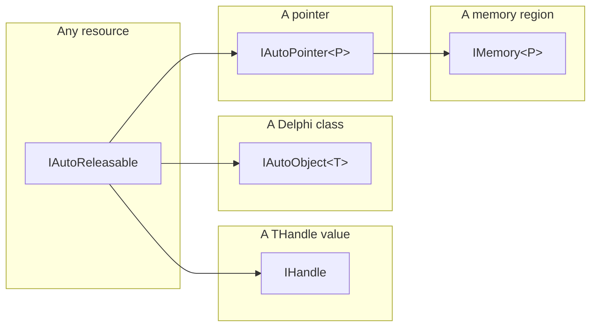

# NtUtils Library

**NtUtils** is a framework for system programming in Delphi that provides a set of functions with better error handling and language integration than regular Winapi/Ntapi [headers](./Headers/Readme.md), combined with frequently used code snippets and intelligent data types.

You can find some example programs [**here**](./Examples.md).

## Dependencies

The library has a layered structure with three layers in total:
 - [**Headers**](./Headers/Readme.md) layer that defines data types and function prototypes from Windows and Native API. It brings zero dependencies and contains almost no code.
 - [**NtUtils**]() layer that provides the most functionality necessary for system programming. It depends exclusively on the headers and **not even on System.SysUtils**, so with some effort, you might be able to compile remarkably small executables that require only ntdll to work. Of course, in this case, you will be limited to Native API, but still.
 - [**NtUiLib**](./NtUiLib) layer that adds support for reflective data representation for the end-users. It depends on NtUtils, `System.SysUtils`, `System.Rtti`, and `System.Generics.Collections`.

Therefore, everything you need is already included with the latest [free versions of Delphi](https://www.embarcadero.com/products/delphi/starter). As a bonus, compiling console applications without RTTI (aka reflection) yields extremely small executables. See [examples](./Examples.md) for more details.

Since including every file from the library into your projects is usually redundant, you can configure Delphi for file auto-discovery. This way, you can specify a unit in the `uses` section, and Delphi will automatically include it and its dependencies into the project. To configure the folders where Delphi performs the search, go to Project -> Options -> Building -> Delphi Compiler and add the following lines into the Search Path:

```
.\NtUtilsLibrary
.\NtUtilsLibrary\Headers
.\NtUtilsLibrary\NtUiLib
```

If the folder names or locations are different for your project, you need to adjust these lines correspondingly.

## Error Handling

All functions return **TNtxStatus** (see [NtUtils.pas](./NtUtils.pas)) as a result instead of raising exceptions. This type is an improved version of NTSTATUS (though it can hold HRESULT and Win32 errors as well) that additionally stores the name of the last called API function plus some optional information (like requested access mask for open calls and information class for query/set calls). It allows building a fast, convenient, and verbose error reporting system. You can also configure capturing stack traces on failure via `NtUtils.CaptureStackTraces`.


If you prefer using exceptions in your code, you can include [NtUiLib.Exceptions](./NtUiLib.Exceptions.pas) that adds `RaiseOnError()` method to **TNtxStatus**.

## Automatic Memory Management

Delphi does not include a garbage collector, so only a few types are managed out-of-the-box: records, strings, dynamic arrays, and interfaces. Classes and pointers, on the other hand, require explicit cleaning-up which (in its safe form) requires using *try-finally* blocks and, therefore, complicates the program significantly.  To address this issue, the library includes facilities for automatic lifetime management for memory and other resources, implemented in [DelphiUtils.AutoObjects](./DelphiUtils.AutoObjects.pas). By using types from this module, we instruct the compiler to automatically generate exception-safe code for counting references and automatically releasing objects in function epilogues. This module defines several interfaces for various types of resources that might requrie cleanup. It introduces the following hierarchy:



`IAutoReleasable` is the base type for all resources that require taking action on (automatic) cleanup. `IHandle` serves as a wrapper for resources defined by a THandle value. `IAutoObject\<T\>` is a generic wrapper for automatically releasing Delphi classes (i.e., anything derived from TObject). `IAutoPointer\<P\>` defines a similar interface for releasing dynamically allocated pointers (where the size of the region is irrelevant). `IMemory\<P\>` provides a wrapper for memory regions of known sizes that can be accessed via a typed pointer, such as managed and unmanaged boxed records.

The recipe for using this facility is the following:

1. Define every variable that needs to maintain (a potentially shared) ownership over an object using one of the interfaces:
   - For classes, use **IAutoObject\<TMyClass\>**.
   - For dynamic memory accessible via a pointer, use **IMemory**, also known as **IMemory\<Pointer\>**.
   - For (managed) boxed records, use **IMemory\<PMyRecord\>**.
   
2. Use the **Auto** helper for allocating/copying/capturing automatic objects:
   - Use **Auto.From\<TMyClass\>(...)** to capture ownership of a class object derived from TObject.
   - Use **Auto.AllocateDynamic(...)** and **Auto.CopyDynamic(...)** for unmanaged structures.
   - Use **Auto.Allocate\<TMyRecord\>(...)** and **Auto.Copy\<TMyRecord\>(...)** for storing managed boxed records on the heap.

3. When necessary, use left-side casting that helps avoiding duplicating type information and can shorten the syntax.

For example, here is a safe code for working with TStringList using the classical approach:

```pascal
var
  x: TStringList;
begin
  x := TStringList.Create;
  try
    x.Add('Hi there');
    x.SaveToFile('test.txt');
  finally
    x.Free;
  end;
end;
```

As you can imagine, using more objects in this function will significantly and non-linearly increase its complexity. Alternatively, here is the equivalent code that uses **IAutoObject** and scales up way better:

```pascal
var
  x: IAutoObject<TStringList>;
begin
  x := Auto.From(TStringList.Create);
  x.Self.Add('Hi there');
  x.Self.SaveToFile('test.txt');
end; 
```

The compiler emits necessary clean-up code into the function epilogue and makes sure it executes even if exceptions occur. Additionally, this approach allows maintaining shared ownership over the underlying object, which lets you save a reference that can outlive the current function (by capturing it in an anonymous function and returning it, for example). If you don't need this functionality and want to maintain a single owner that frees the object when the function exits, you can simplify the syntax even further:

```pascal
var
  x: TStringList;
begin
  x := Auto.From(TStringList.Create).Self;
  x.Add('Hi there');
  x.SaveToFile('test.txt');
end; 
```

This code is still equivalent to the initial one. Internally, it creates a hidden local variable that stores the interface and later releases the object.

When working with dynamic memory allocations, it can be convenient to use left-side casting as following:

```pascal
var
  x: IMemory<PByteArray>;
begin
  IMemory(x) := Auto.AllocateDynamic(100);
  x.Data[15] := 20;
end;
```

You can also create boxed (allocated on the heap) managed records that allow sharing value types as if they are reference types. Note that they can also include managed fields like Delphi strings and dynamic arrays - the compiler emits code for releasing them automatically:

```pascal
type
  TMyRecord = record
    MyInteger: Integer;
    MyArray: TArray<Integer>;
  end;                   
  PMyRecord = ^TMyRecord;

var
  x: IMemory<PMyRecord>;
begin
  IMemory(x) := Auto.Allocate<TMyRecord>;
  x.Data.MyInteger := 42;
  x.Data.MyArray := [1, 2, 3];
end;
```

Since Delphi uses reference counting, it is still possible to leak memory if two objects have a circular dependency. You can prevent it from happening by using *weak references*. Such reference does not count for prolonging lifetime, and the variable that stores them becomes automatically becomes **nil** when the target object gets destroyed. You need to upgrade a weak reference to a strong one before you can use it. See **Weak\<I\>** from DelphiUtils.AutoObjects for more details.

There are some aliases available for commonly used variable-size pointer types, here are some examples:

 - IAutoPointer = IAutoPointe\<Pointer\>;
 - IMemory = IMemory\<Pointer\>;
 - ISid = IMemory\<PSid\>;
 - IAcl = IMemory\<PAcl\>;
 - ISecDesc = IMemory\<PSecurityDescriptor\>;
 - etc.

## Handle Types

Handles use the **IHandle** type (see [DelphiUtils.AutoObjects](./DelphiUtils.AutoObjects.pas)), which follows the logic discussed above, so they do not require explicit closing. You can also find some aliases for IHandle (IScmHandle, ISamHandle, ILsaHandle, etc.), which are available merely for the sake of code readability.

If you ever need to capture a raw handle value into an IHandle, you need a class that implements this interface plus knows how to release the underlying resource. For example, [NtUtils.Objects](./NtUtils.Objects.pas) defines such class for kernel objects that require calling `NtClose`. It also attaches a helper method to `Auto`, allowing capturing kernel handles by value via `Auto.CaptureHandle(...)`.

## Naming Convention

Names of records, classes, and enumerations start with `T` and use CamelCase (example: `TTokenStatistics`). Pointers to records or other value-types start with `P` (example: `PTokenStatistics`). Names of interfaces start with `I` (example: `ISid`). Constants use ALL_CAPITALS. All definitions from the headers layer that have known official names (such as the types defined in Windows SDK) are marked with an `SDKName` attribute specifiying this name.

Most functions use the following name convention: a preffix of the subsystem with _x_ at the end (Ntx, Ldrx, Lsax, Samx, Scmx, Wsx, Usrx, ...) + Action + Target/Object type/etc. Function names also use CamelCase.

## OS Versions

The library targets Windows 7 or higher, both 32- and 64-bit editions. Though, some of the functionality might be available only on the latest 64-bit versions of Windows 11. Some examples are AppContainers and ntdll syscall unhooking. If a library function depends on an API that might not present on Windows 7, it uses delayed import and checks availability in runtime.

## Reflection (aka RTTI)

Delphi comes with a rich reflection system that the library utilizes within the [**NtUiLib**](./NtUiLib) layer. Most of the types defined in the [**Headers**](./Headers/Readme.md) layer are decorated with custom attributes (see [DelphiApi.Reflection](./Headers/DelphiApi.Reflection.pas))  to achieve it. These decorations emit useful metadata that helps the library to precisely represent complex data types (like PEB, TEB, USER_SHARED_DATA) in runtime and produce astonishing reports with a single line of code.

Here is an example representation of TSecurityLogonSessionData from [Ntapi.NtSecApi](./Headers/Ntapi.NtSecApi.pas) using [NtUiLib.Reflection.Types](./NtUiLib/NtUiLib.Reflection.Types.pas):


